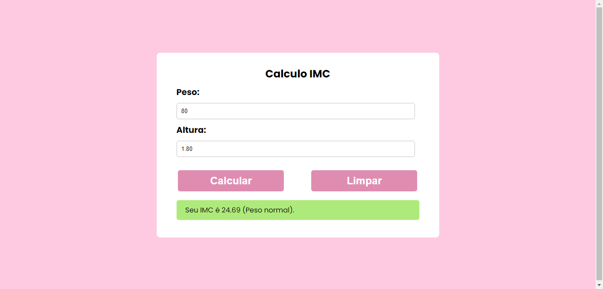
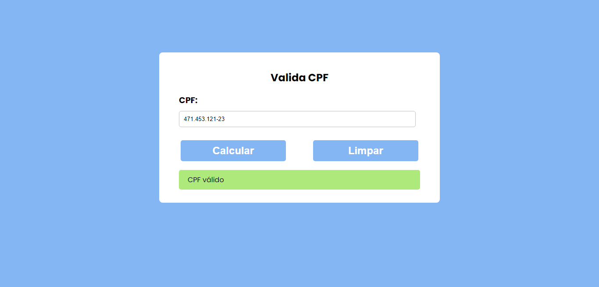
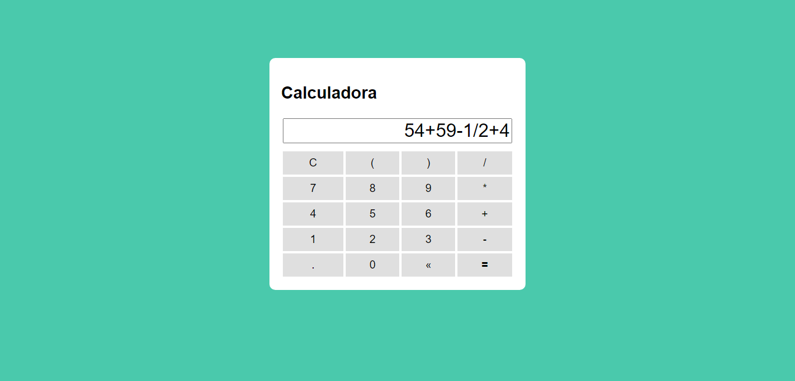
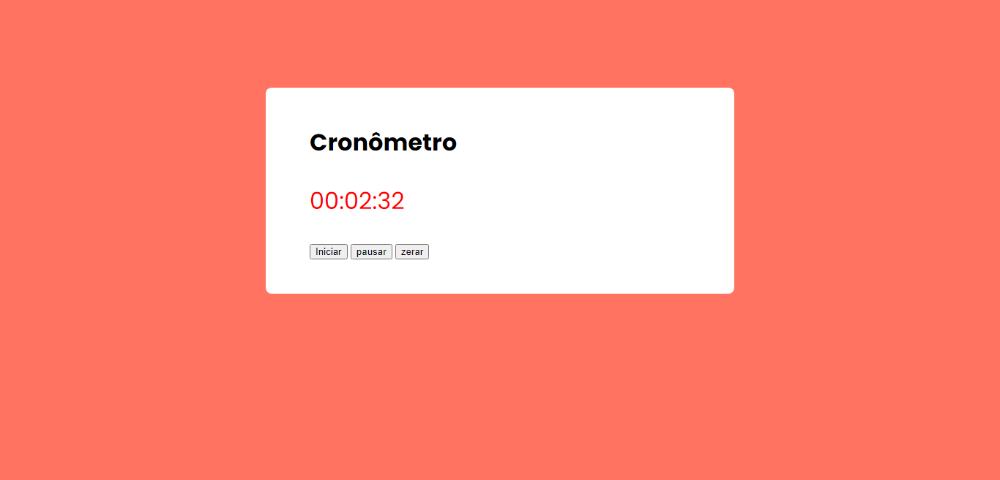
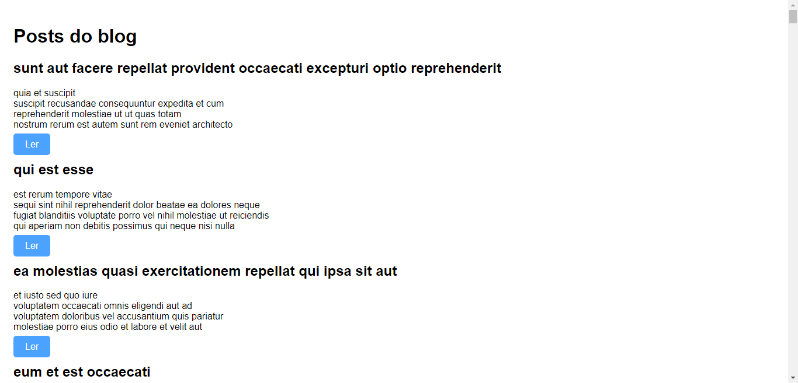

# Projetinhos em JavaScript

 <a href="#-sobre">Sobre</a> •
 <a href="#-projetos">Projetos</a> •
 <a href="#%EF%B8%8F-autor">Autor</a>

## 💻 Sobre

Coleção de projetos desenvolvidos em JavaScript, com o objetivo de aprimorar as habilidades de lógica de programação e manipulação do DOM. Os projetos presentes aqui são exemplos simples, mas úteis, como calculadora de IMC, validação de CPF, Cronomêtro, entre outros.

- [x] Página para calcular IMC
- [x] Página para validar CPF
- [x] Página com calculadora
- [x] Página com cronomêtro
- [x] Página do Churrascômetro
- [x] Página de "posts" e comentários

<h3 align="center">
⚙️ Tecnologias utilizadas

&nbsp;

</h3>

---

## 🚧 Projetos

<h3 align="center">Páginas dos projetos
  

 
 
 
 
 
</h3>

 
<h2 id="tech">Uso de API</h2>

O projeto é uma página simples de "posts" que utiliza uma API para obter dados (posts) que a API retorna e inseri-los na página e também permite a inserção de novos dados (comentários do post) a API no formulário de comentários de cada post.

 

 
 

## ✒️ Autor

| [    Cherlau Prado ](https://github.com/cherPrado) |
| :--------------------------------------------------------------------------------------------------------------------------------------------: |

<h2 >Entre em contato 🤙🏽</h2>

